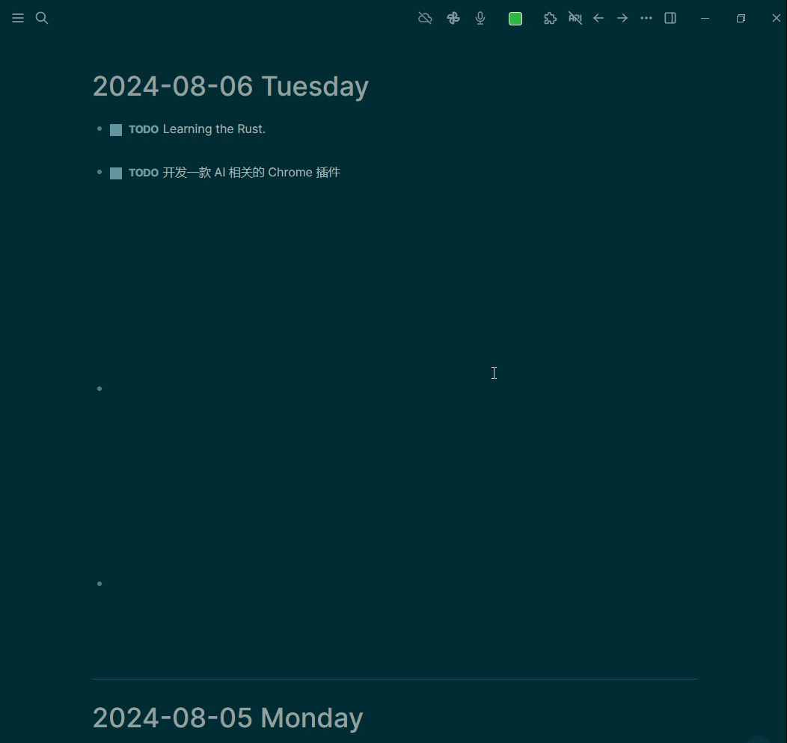

[中文](README.CN.md) | English

- # loseq-magic-todo
  - Logseq Magic ToDo is a plugin specifically designed for Logseq, utilizing AI technology to automatically break down complex tasks into smaller, more manageable parts. Through intelligent recognition and recommendations, it helps users enhance their task management efficiency, seamlessly integrating into the Logseq workflow.
- ## Demo
  - 
  - [demo](./demo.mp4)
- ## Licence
  - [MIT](https://choosealicense.com/licenses/mit/)
